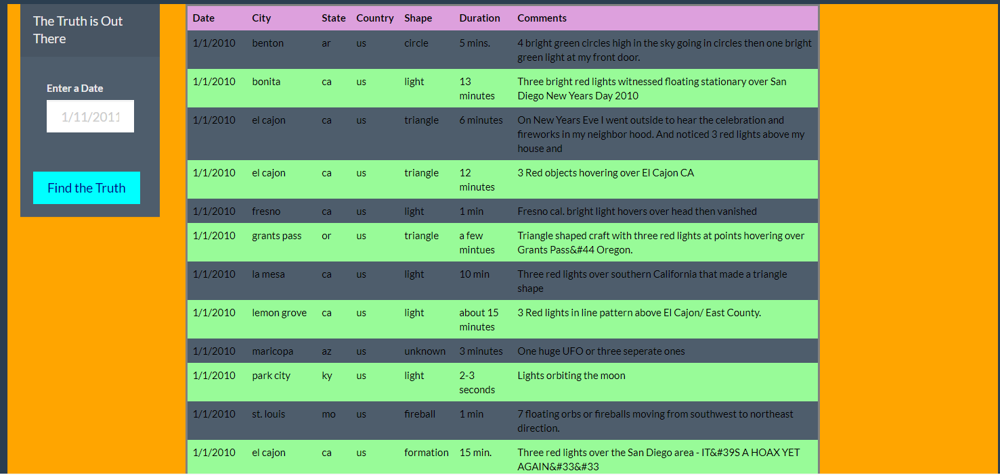
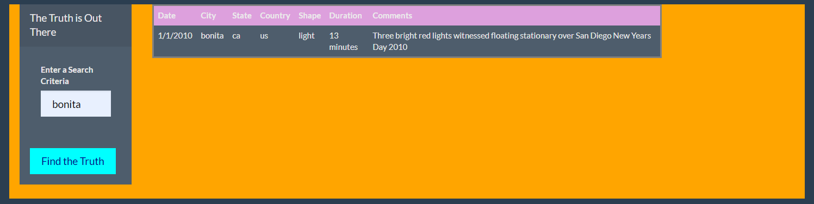

# javascript_challenge

Project Description

The task was to create a HTML webpage to create a dynamic table for UFO sitings using Javascript and D3. The table was set up to allow filtering using specific values. 
This will make it easier to find reports for the viewers.

Tools Required

Javascript, 
HTML, 
CSS, 
D3.js

Instructions

• Create a basic html to read js file 
• Create variables for data and to reference table body 
• Loop through data to create rows for table and add values too cells 
• Add listening event (button click) for filtering rows • Loop through data to get filtered rows 
• Modify listening event to use multiple values.

Files

app.js – provides all code to create table with data on html and the listening event to 
filter through the data

data – contains ufo data use for the rows
css.js – contains code to style webpage
index.html – contains code to display webpage and app.js

Results
Unfiltered

Filtered

A webpage was created that displayed the provided ufo data in a table using javascript and D3.js. A listening event was included to filter the data on one value, the date. Advanced work is still in progress to create a listening event to filter on multiple values.
